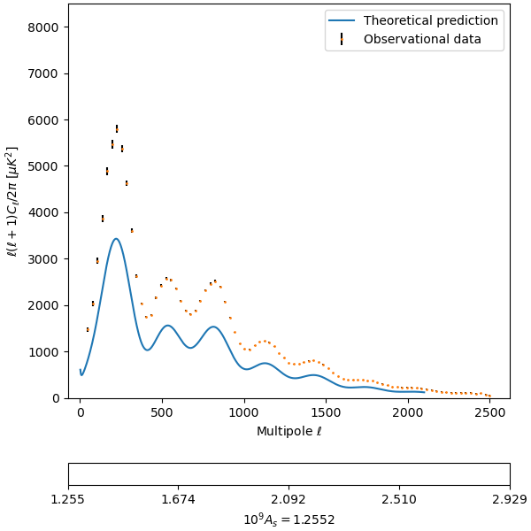

# bachelors-thesis
This repository contains the Jupyter Notebooks I developed to create the graphs for my Bachelor's Thesis. All data was generated with CAMB Online (NASA)

I like math!
$$Z=\int \exp(-\beta H)$$

Look at this GIF:

