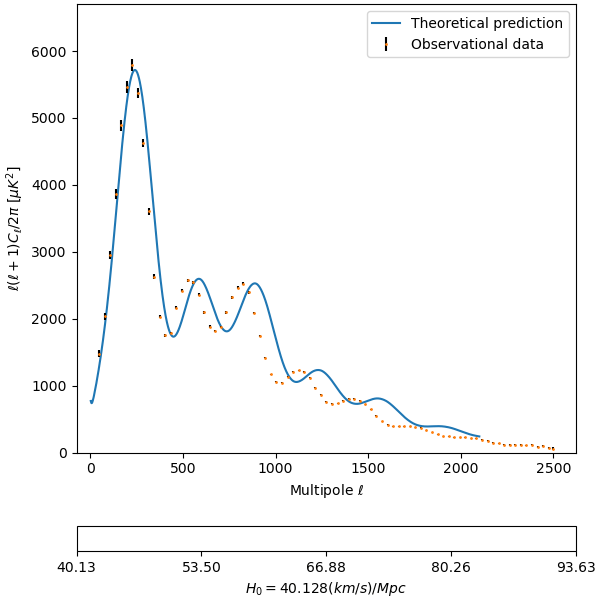

# Bachelor's Thesis: Cosmological observables and their dependence on ΛCDM model parameters
This repository contains the Jupyter Notebooks I developed to create the graphs for my Bachelor's Thesis. All data was generated with CAMB Online (NASA).

This is one of the generated GIFs, showing how the power spectrum changes when the Hubble parameter is varied.

